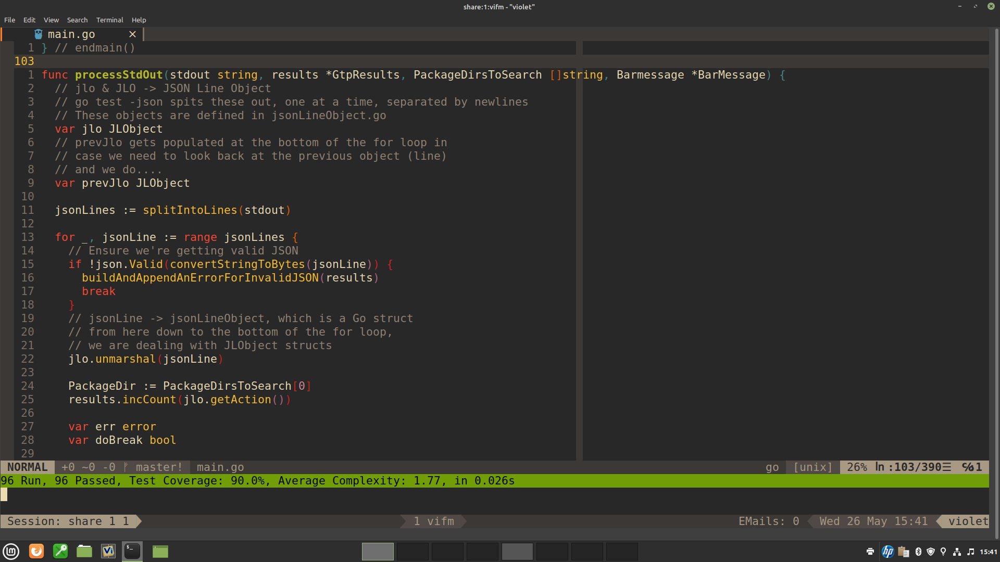
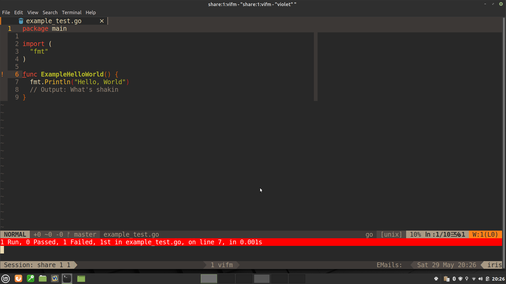
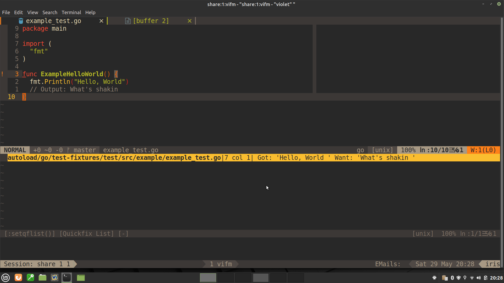
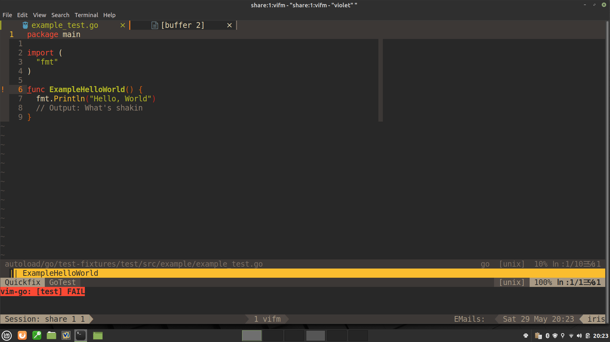

This is a Vim plugin that I wrote in Golang for my own use to smooth my Golang
learning and development experience.

The plugin is 92+% in Golang and about 7% in Vimscript and the
tiniest bit of shell script thrown in.

It seeks to add two things to your Golang TDD development:

	RedBar/GreenBar/Refactor Test Driven Development style programming

	A marginally better 'vim-go go test' experience

go-tdd runs and parses the output of go test so as to provide Vim/Neovim
instructions on what message to display, and in what color.
Green bar messages indicate all tests passed. A red bar message indicates
that tests ran, but at least one failed. If any tests are skipped, that is
reported on a yellow bar.   A yellow bar also can indicate an error or
concerning circumstance not directly related to a failing test.

Right now these yellow bar messages include
	[no tests found],
	[no tests to execute] - basically empty test file(s) [build failed],
	[received a panic]
	[test timed out panic]
	[invalid JSON message], and the
	receipt of any message on STDERR.

If there is output on STDERR,  go-tdd shows a snippet of the
message in a yellow bar.  If the STDERR message is longer than can be
shown in a one line yellow bar, I capture the entire message in StdErr.txt
in the package directory. There is a key mapping of <LocalLeader>e that
loads StdErr.txt into the editor for your perusal.

If go-tdd encounters non JSON lines on stdout, it issues a yellow
bar message and quits. I don't remember that happening in actual use.

I have added supplemental messages providing detail information in each
red or green bar.  They report the number of tests run, passed, failed,
and skipped, in addition to the elapsed time for running all the tests
as provided by go test. Test coverage is reported on Green Bars.

I have also added Average Cyclomatic Complexity to the Green Bars.
It is a metric I want to be aware of. I hear that several well known IDEs
start warning about Cyclomatic Complexity at 10.  I like to keep mine below
2.5.  This project is at 1.8 as I write this.

Many experienced developers find that test driven development, along with
low cyclomatic complexities help to achieve robust applications more quickly
than might otherwise be achieved.  I certainly have, so much so that I built
this tool to supplement vim-go for my own use. This project has ~87% test
coverage as I write this (basically everything but main() and a few
logFatal() type calls).

go-tdd is designed to work alongside of vim-go, since, really,
vim-go is my most important Golang development tool.

The second benefit listed above was a "marginally better go test
experience".  vim-go reports [SUCCESS] in directories with no test files
at all or where there are test files but they are empty, or where one, or
many tests are skipped. I am not an old Golang hand, but this does not
strike me as "[SUCCESS]".  Especially if I am looking at a code base that
is new to me, I don't want my tools reporting these situations as "[SUCCESS]".
So in go-tdd I have incorporated a "Yellow Bar", message for situations
which are not directly due to a failing test but which the developer
should be aware of, thus providing that "marginally better go test
experience" I mentioned above.

Here is go-tdd's presentation of an Example Function failure:

And here is go-tdd's presentation of the Vim QuickFix List with the
gathered up failure message, filename, and line number:

go-tdd also improves on your go test experience by treating Go's Example
tests as full fledged equals in the testing environment.  For some reason
the Go Team elected to treat Example functions differently than the normal
full fledged tests, and only provide the Example function's name and not
the name of the file it resides in and the line number it can be found at.
They do provide the error message the failing Example function puts out,
but spread over the next four lines of output after the failure
announcement. go-tdd does the necessary leg work to gather the missing and
wayward info so it can elevate the Example function to the same level as
normal tests.

To accomplish this, go-tdd provides its own go test parser, written
entirely in golang, somewhat simpler than vim-go's and synchronous instead
of asynchronous, which parses the 'go test -v -json' output and in turn,
provides a JSON structure which details for Vim what message, and in what
color to deliver.  It also provides Vim a quickfix list of test failures
and/or skipped tests which Vim loads for your use.

Below illustrates how vim-go presents Example Function failures:

This is typical of how Example Functions are handled by editors and IDEs.

go-tdd's synchronous invocation of 'go test -v -json -cover' has not
really been noticeable for me. I rarely see go test take more than a few
hundredths of a second to complete even hundreds of tests. Most reported
times are in the thousandths of seconds and go-tdd, written almost
entirely in Golang itself, does its job probably orders of magnitude more
quickly than a tool written in Vimscript could.

In this style of development, the RedBar/GreenBar (and YellowBar)s are the
primary layer of communication with the developer, so go-tdd loads
the quickfix list for you, but it does not force you to go to the failed
test. I find that often in my development work flow, I sometimes don't need
to go to the test at all, but instead want to peruse  and
fix the function that caused the failure, and I may already be there.

The RedBar/GreenBar/YellowBar message line lingers until any key is
pressed (I typically just hit the space bar).

<Space> (or any other key, for that matter) dismisses the Green/Red/Yellow
bars.

Configuration:

If you are using vim-plug:
	Plug 'davidsday/go-tdd', {'for': [ 'go' ], 'branch': 'master', 'do': './install.sh'}
	Plug 'Valloric/ListToggle'
		If you use this, <Leader>q toggles the quickfix window open and closed

go-tdd comes with a small number of user alterable configuration
settings and maps.

I have gathered them all into go-tdd/plugin/go_tdd_local.vim and it looks
like this:

	" the actual file does not have these comments
	let g:go_tdd_debug=v:false " set to v:true if you want to log JSON sent to vim
	let g:gocyclo_ignore="'vendor|testdata'"  "regex for gocyclo to ignore
	let g:go_list_type = 'quickfix'  " my pref is to only use quickfix

	" toggle between mygofile.go and mygofile_test.go
	nnoremap <LocalLeader>a  call go#alternate#Switch(<bang>0, 'edit')
  " edit StdErr.txt
	nnoremap <LocalLeader>e  <ESC>:e StdErr.txt<CR>
	" navigate quickfix list down and up
	nnoremap <C-j> :cnext<CR>
	nnoremap <C-k> :cprev<CR>

	" run go-tdd on package in current dir
	nmap <silent> <LocalLeader>t <Plug>(RunGoGreenBarTests)
	" run verbosely - just shows go test -v -json -cover verbose output
	nmap <silent> <LocalLeader>v <Plug>(RunGoTestsVerbose)

If you need to make changes, please copy this file to
your config dir

(~/.vim/ or ~/.config/nvim/)after/ftplugin/go_tdd_local.vim

and make any changes there.  That way your changes will not be overwritten
every time you refresh this plugin from github.

Life is good.....

Dave
